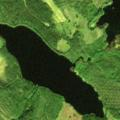

	

		
BigEarthNet - A New Large-Scale Sentinel-2 Benchmark Archive <b>(Coming Soon!)</b>

		
The BigEarthNet archive contains 590,326 Sentinel-2 image patches with multiple annotations. Some example patches are given below.

		

			

				

					
  					
<small>Continuous urban fabric, Green urban areas</small>

				

			

			

				

					
  					
<small>Non-irrigated arable land, Fruit trees and berry plantations, Pastures</small>

				

			

			

				

					
  					
<small>Pastures, Water courses, Water bodies</small>

				

			

			

				

					
  					
<small>Construction sites, Non-irrigated arable land, Pastures, Coniferous forest, Inland marshes, Water courses</small>

				

			

		

		

			

				

					
  					
<small>Non-irrigated arable land, Pastures, Moors and heathland</small>

				

			

			

				

					
  					
<small>Land principally occupied by agriculture, with significant areas of natural vegetation, Beaches, dunes, sands, Intertidal flats, Estuaries, Sea and ocean</small>

				

			

			

				

					
  					
<small>Discontinuous urban fabric, Construction sites, Green urban areas</small>

				

			

			

				

					
  					
<small>Coniferous forest, Mixed forest, Transitional woodland/shrub, Water bodies</small>

				

			

		

    

