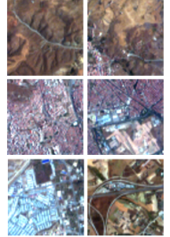

	

    <h4>HySpecNet-11K - A Large-Scale Hyperspectral Benchmark Dataset: </h4>

 	

		

			
		

		

		
HySpecNet-11k is a large-scale hyperspectral benchmark dataset made up of 11,483 nonoverlapping image patches acquired by the EnMAP satellite. Each patch is a portion of 128 × 128 pixels with 224 spectral bands and with a ground sample distance of 30 m.

    	
For the details see <a href="https://hyspecnet.rsim.berlin" target="_blank">hyspecnet.rsim.berlin</a>.

    	
If you use HySpecNet-11k in your research, please cite our paper:
    	  
    	M. H. P. Fuchs and B. Demir, "<a href="https://arxiv.org/abs/2306.00385" target="_blank">HySpecNet-11k: a Large-Scale Hyperspectral Dataset for Benchmarking Learning-Based Hyperspectral Image Compression Methods</a>", IEEE International Geoscience and Remote Sensing Symposium, Pasadena, CA, USA, 2023, pp. 1779-1782, doi: 10.1109/IGARSS52108.2023.10283385.
    	

    	

    

    

    <h4>Multi-label Remote Sensing Image Retrieval Archive:</h4>

 	

		

			
		

		

		
We have manually labeled each image in the <a href="http://vision.ucmerced.edu/datasets/landuse.html" target="_blank">UC-Merced archive</a> with one or more (maximum seven) labels based on visual inspection in order to create the ground reference data. The total number of distinct class labels associated for the considered archive is 17.

    	
Download the Labels from <a href="./assets/docs/multilabels.zip" target="_blank">here</a>.

    	
For the details see <a href="http://ieeexplore.ieee.org/document/8089668/" target="_blank">our paper</a>.

    	
If you use our multi-labels, please cite:
    	  
    	B. Chaudhuri, B. Demir, S. Chaudhuri, L. Bruzzone, "Multi-label Remote Sensing Image Retrieval using a Semi-Supervised Graph-Theoretic Method", IEEE Transactions on Geoscience and Remote Sensing, vol. 56, no.1, 2018.
    	

    	

    

    

    <h4>Ankara Hyperspectral Image Archive:</h4>
    

    	

    		
    	

        

    	
The Ankara benchmark archive consists of 216 hyperspectral image tiles obtained by fragmenting a hyperspectral image acquired by EO-1 Hyperion sensor over surroundings of Ankara, Turkey. Each image tile has been annotated with: i) multiple land-cover class labels and ii) a land-use category label.

    	
Download the archive from <a href="http://bit.ly/Ankara_HSI_Archive" target="_blank">here</a>. For the details see <a href="./assets/docs/ankara_hsi/Readme.txt">Readme file</a> and also our <a href="./assets/docs/ankara_hsi/CHIR-2016.pdf">paper</a>.

    	
If you use our archive, please cite:
    	  
    	F. Ömrüuzun, B. Demir, L. Bruzzone and Y. Y. Çetin, "Content based hyperspectral image retrieval using bag of endmembers image descriptors," 8th Workshop on Hyperspectral Image and Signal Processing: Evolution in Remote Sensing (WHISPERS), Los Angeles, CA, 2016, pp. 1-4.

    	

    

    

