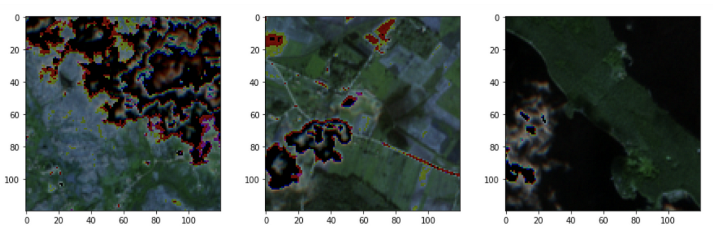
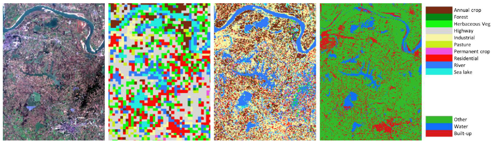

	

		

			This page is devoted to list the BigEarthNet related datasets and tools that are developed by researchers outside from TU Berlin and are publicly available.
		

		<h4></h4>
		

			<b>About BigEarthNet:</b> The BigEarthNet archive was constructed by the Remote Sensing Image Analysis (RSiM) Group and the Database Systems and Information Management (DIMA) Group at the Technische Universität Berlin (TU Berlin). This work is supported by the European Research Council under the ERC Starting Grant BigEarth and by the German Ministry for Education and Research as Berlin Big Data Center (BBDC).
		

		

			For the details about BigEarthNet, please visit <a href="http://bigearth.net" target="_blank">BigEarthNet</a>.
		

		

			If you have publicly available BigEarthNet related datasets and software tools, please let us know via <a href="mailto:contact@bigearth.eu">contact@bigearth.eu</a>! We would be happy to list your work here!
		

		

		

			

				
			

			

				<a href="https://www.linkedin.com/in/shane-keller-ba891315/" target="_blank">Shane Keller</a>
				 
				<a href="https://towardsdatascience.com/outperforming-google-cloud-automl-vision-with-tensorflow-and-google-deep-learning-vm-34a45e3860ae" target="_blank">Detecting clouds in satellite images with Deep Learning</a>
				 
				GitHub Repository: <a href="https://github.com/skeller88/deep_learning_project" target="_blank">https://github.com/skeller88/deep_learning_project</a>
			

		

		

		

			

				
			

			

				Vasileios Syrris, Ondrej Pesek, Pierre Soille
				 
				<a href="https://arxiv.org/abs/2006.10623" target="_blank">SatImNet: Structured and Harmonised Training Data for Enhanced Satellite Imagery Classification</a>
				 
				GitHub Repository: TBD
			

		

	

<!-- Modal -->
<!-- The Modal -->

  &times;
  
  

