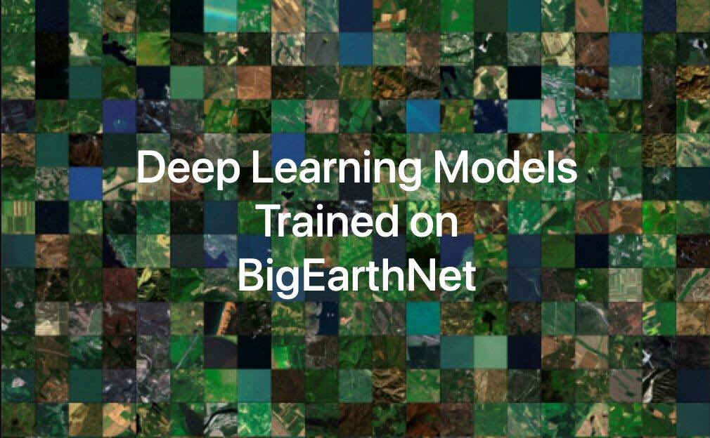
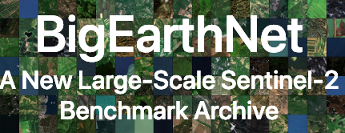
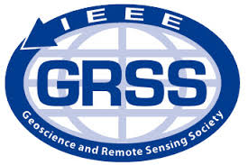
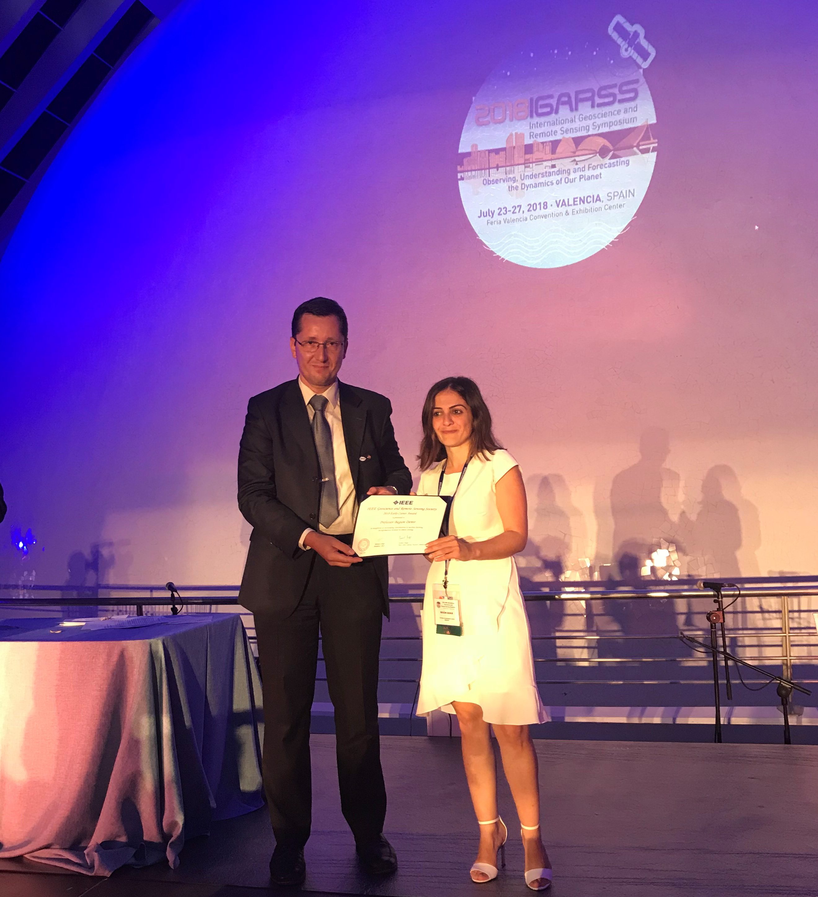
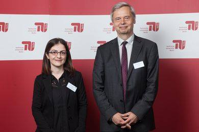

	

		<!-- 

			

				
			

			

				<b>May 2021</b> - <a href="http://bigearth.net" target="_blank">BigEarthNet</a> has been enriched by including Sentinel-1 images. The new version contains 590,326 pairs of Sentinel-1 and Sentinel-2 image patches to support research studies on multi-modal/cross-modal image classification, retrieval and search.
			

		

		
 -->
		

			

				
			

			

				<b>July 2021</b> - CLC labels in BigEarthNet  
				The CLC labels in BigEarthNet belong to the initial release of the CLC 2018 products in 2018.
                  Since 2018, there are some revisions applied to CLC 2018 products.  For details, please visit:
                  <a href="https://land.copernicus.eu/pan-european/corine-land-cover/clc2018?tab=metadata" target="_blank">https://land.copernicus.eu/pan-european/corine-land-cover/clc2018?tab=metadata</a>.
                  The current version of the BigEarthNet does not include the CLC revisions.
			

		

		

		

			

				
			

			

				<b>May 2021</b> - We are hiring!  
				Please contact Prof. Dr. Begüm Demir through <a href="mailto:demir@bigearth.eu">demir[at]bigearth.eu</a> for details.
			

		

		

		

			

				
			

			

				<b>December 2020</b> - <a href="http://bigearth.net" target="_blank">BigEarthNet</a> has been enriched by including Sentinel-1 images. The new version contains 590,326 pairs of Sentinel-1 and Sentinel-2 image patches to support research studies on multi-modal/cross-modal image classification, retrieval and search.
			

		

		

		

			

				
			

			

				<b>September 2020</b> - The codes developed and maintained at <a href="https://www.rsim.tu-berlin.de/menue/remote_sensing_image_analysis_group/" target="_blank">RSiM</a> are publicly available <a href="https://www.rsim.tu-berlin.de/menue/software/" target="_blank">here</a>.
			

		

		

		

			

				
			

			

				<b>July 2020</b> - There are several researchers and colleagues all around the world, contributing to advance <a href="bigearth.net" target="_blank">BigEarthNet</a> through their BigEarthNet related software tools and datasets. We appreciate their excellent work and effort! For details, please see <a href="https://bigearth.eu/externals">BigEarthNet Externals</a>.
			

		

		

		

			

				
			

			

				<b>March 2020</b> - We made public an alternative class-nomenclature to allow DL models for better learning&describing the complex spatial/spectral information content of Sentinel-2 images in <a href="bigearth.net" target="_blank">BigEarthNet</a>. The new class nomenclature is the product of a collaboration between the "<a href="https://eportugal.gov.pt/entidades/direcao-geral-do-territorio" target="_blank">Direção-Geral do Território</a>" in Lisbon, Portugal and the <a href="rsim.tu-berlin.de" target="_blank">Remote Sensing Image Analysis (RSiM)</a> group at TU Berlin, Germany. For details, please visit <a href="https://git.tu-berlin.de/rsim/bigearthnet-19-models" target="_blank">this link</a>.
			

		

		

		

			

				
			

			

				<b>January 2020</b> - Deep Learning Models trained on BigEarthNet have been released. For the details, please visit <a href="http://bigearth.net/#downloads">BigEarthNet website</a>.
			

		

		

		

			

				
			

			

				<b>March 2019</b> - We have made public our <a href="http://www.bigearth.net" target="_blank">BigEarthNet</a> archive that is significantly larger than the existing archives in remote sensing and opens up promising directions to advance research for the analysis of large-scale remote sensing image archives.
			

		

		

		

			

				
			

			

				<b>November 2018</b> - Prof. Dr. Demir has been appointed as an Associate Editor for the <a href="http://www.grss-ieee.org/publication-category/grsl/" target="_blank">IEEE Geoscience and Remote Sensing Letters</a>.
			

		

		

		

			

				
			

			

				<b>July 2018</b> - Prof. Dr. Demir is the recipient of the prestigious <b>“2018 Early Career Award”</b> presented by the IEEE Geoscience and Remote Sensing Society (GRSS).  IEEE GRSS founded in 1962 is the most important international scientific society in the field of geosciences and remote sensing. Factors considered for assigning the award are: quality, the significance and impact of contributions, papers published in archival journals, papers presented at conferences and symposia, a demonstration of leadership, and advancement of the profession.
			

		

		

		

			

				
			

			

				<b>April 2018</b> - BigEarth has moved to TU Berlin and officially started in April 1st!  
				<a href="http://www.pressestelle.tu-berlin.de/menue/tub_medien/publikationen/medieninformationen/2018/mai_2018/medieninformation_nr_732018/">For more details...</a>
			

		

		

		

			

				
			

			

				<b>September 2017</b> - BigEarth is on <a href="http://www.pressreader.com/italy/corriere-del-trentino/20170916/281487866520040" target="_blank">Corriere del Trentino</a>.
			

		

		

		

			

				
			

			

				<b>September 2017</b> - BigEarth is on <a href="http://www.buyukkocaeli.com.tr/tarih-seni-yazacak-begum-hoca-11692h.htm" target="_blank">local Turkish newspaper</a>.
			

		

		

		

			

				
			

			

				<b>September 2017</b> - Thanks to <a href="https://erc.europa.eu" target="_blank">European Research Council (ERC)</a> <a href="https://erc.europa.eu/sites/default/files/document/file/erc_2017_stg_results_pe.pdf" target="_blank">Starting Grant</a>, Begüm Demir will make her dreams on 'BigEarth - Accurate and Scalable Processing of Big Data in Earth Observation' come true.
			

		

	

<!-- Modal -->
<!-- The Modal -->

  &times;
  
  

