

	

		

			<b>Note:</b> This publication list includes only BigEarth-related publications. For the full list, please <a href="http://begumdemir.com/papers.html" target="_blank">see</a>. PDFs given in this web page are the authors' draft versions of the related papers. For the whole list of the software developed and maintained at our group, please visit <a href="https://www.rsim.tu-berlin.de/menue/software/" target="_blank">here</a>.
		

		

		

			

				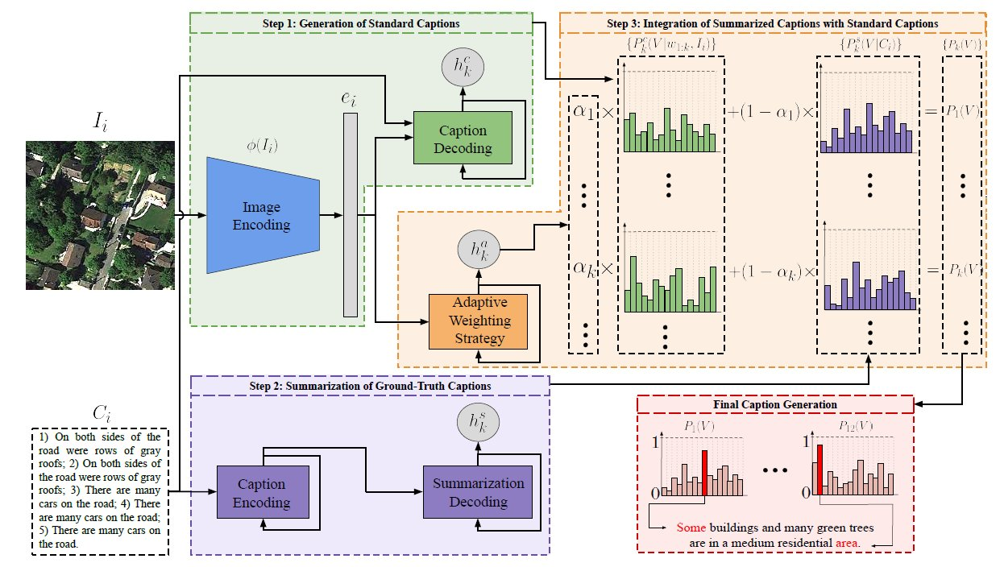
			

			

				SD-RSIC: Summarization Driven Deep Remote Sensing Image Captioning 
				Gencer Sumbul, Sonali Nayak, Begüm Demir 
				IEEE Transactions on Geoscience and Remote Sensing, accepted for publication, 2020. 
				<a class="publication-icon" href="https://arxiv.org/pdf/2006.08432.pdf" target="_blank"><i class="fa fa-file-pdf-o text-color-be"></i></a>
				<a class="publication-icon" href="https://gitlab.tu-berlin.de/rsim/SD-RSIC" target="_blank"><i class="fa fa-github text-color-be"></i></a>
			

		

		

		

			

				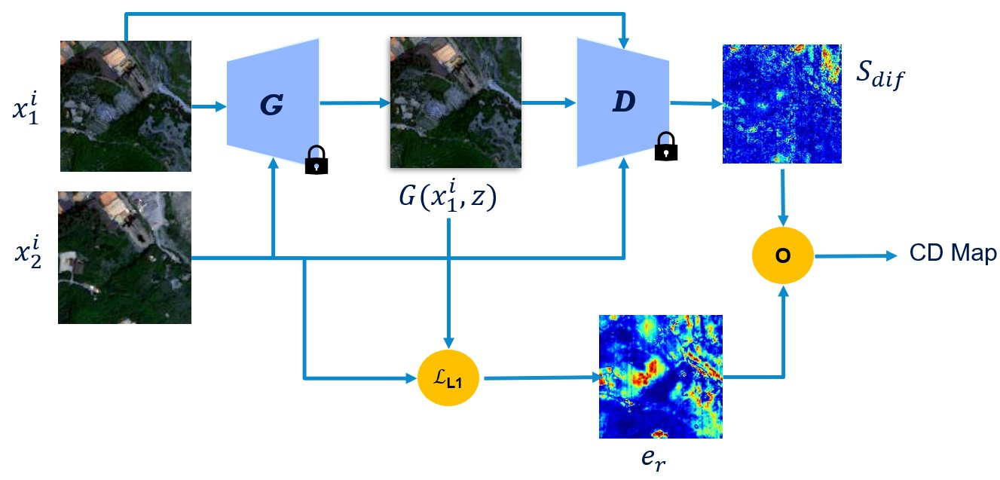
			

			

				S2-cGAN: Self-Supervised Adversarial Representation Learning for Binary Change Detection in Multispectral Images  
				Jose Luis Holgado Alvarez, Mahdyar Ravanbakhsh, Begüm Demir 
				IEEE International Geoscience and Remote Sensing Symposium, Hawaii, USA, 2020. 
				<a class="publication-icon" href="https://arxiv.org/abs/2007.02565" target="_blank"><i class="fa fa-file-pdf-o text-color-be"></i></a>
				<a class="publication-icon" href="https://gitlab.tubit.tu-berlin.de/rsim/S2-cGAN" target="_blank"><i class="fa fa-github text-color-be"></i></a>
			

		

		

		

			

				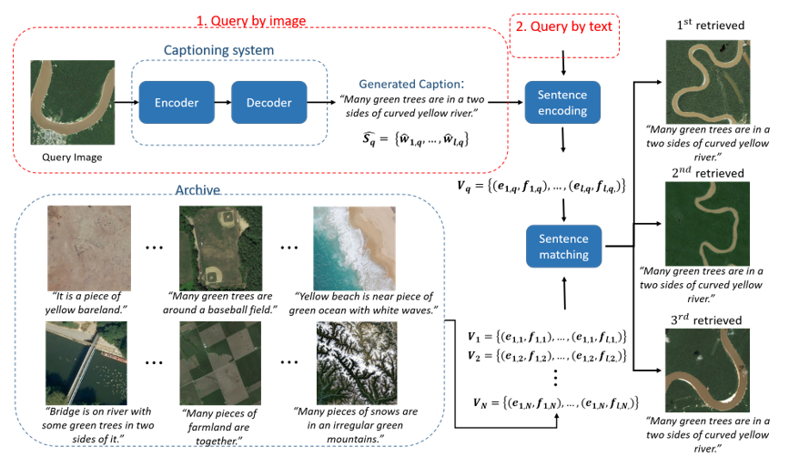
			

			

				Toward Remote Sensing Image Retrieval under a Deep Image Captioning Perspective  
				Genc Hoxha, Farid Melgani, Begüm Demir 
				IEEE Journal of Selected Topics in Applied Earth Observations and Remote Sensing, In press, 2020. 
				<a class="publication-icon" href="https://ieeexplore.ieee.org/stamp/stamp.jsp?tp=&arnumber=9154525" target="_blank"><i class="fa fa-file-pdf-o text-color-be"></i></a>
			

		

		

		

			

				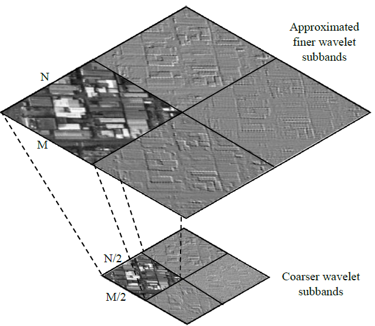
			

			

				Remote Sensing Image Scene Classification with Deep Neural Networks in JPEG 2000 Compressed Domain  
				Akshara Preethy Byju, Gencer Sumbul, Begüm Demir, Lorenzo Bruzzone 
				IEEE Transactions on Geoscience and Remote Sensing, In press, 2020. 
				<a class="publication-icon" href="https://arxiv.org/abs/2006.11529" target="_blank"><i class="fa fa-file-pdf-o text-color-be"></i></a>
			

		

		

		

			

				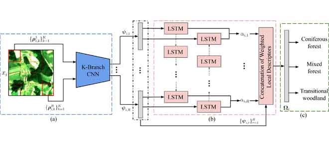
			

			

				A Deep Multi-Attention Driven Approach for Multi-Label Remote Sensing Image Classification  
				Gencer Sumbul, Begüm Demir 
				IEEE Access, vol. 8, pp. 95934-95946, 2020. 
				<a class="publication-icon" href="https://ieeexplore.ieee.org/stamp/stamp.jsp?tp=&arnumber=9096309" target="_blank"><i class="fa fa-file-pdf-o text-color-be"></i></a>
				<a class="publication-icon" href="https://gitlab.tubit.tu-berlin.de/rsim/MAML-RSIC" target="_blank"><i class="fa fa-github text-color-be"></i></a>
			

		

		

		

			

				
			

			

				A Progressive Content Based Image Retrieval in JPEG 2000 Compressed Remote Sensing Archives  
				Akshara Preethy Byju, Begüm Demir, Lorenzo Bruzzone 
				IEEE Transactions on Geoscience and Remote Sensing, vol. 58, no. 8, pp. 5739-5751, 2020. 
				<a class="publication-icon" href="assets/publications/pdfs/PCBIR_2020.pdf" target="_blank"><i class="fa fa-file-pdf-o text-color-be"></i></a>
			

		

		

		

			

				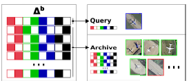
			

			

				Unsupervised Remote Sensing Image Retrieval using Probabilistic Latent Semantic Hashing 
				Ruben Fernandez-Beltran, Begüm Demir, Filiberto Pla, Antonio Plaza 
				IEEE Geoscience and Remote Sensing Letters, in press, 2020. 
				<a class="publication-icon" href="assets/publications/pdfs/GRSL_Probabilistic_Latent_Semantic_Hashing_Codes_2020.pdf" target="_blank"><i class="fa fa-file-pdf-o text-color-be"></i></a>
			

		

		

		

			

				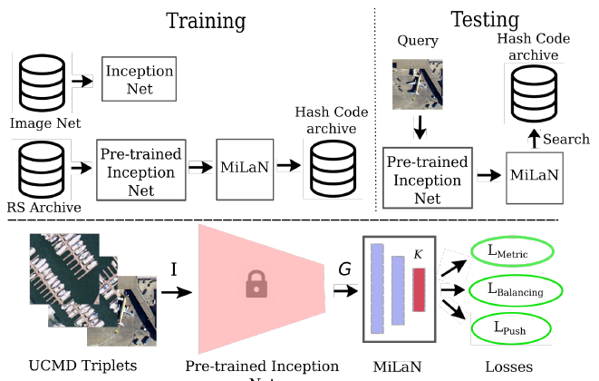
			

			

				Metric-Learning based Deep Hashing Network for Content Based Retrieval of Remote Sensing Images 
				Suphankar Roy, Enver Sangineto, Begüm Demir, Nicu Sebe 
				IEEE Geoscience and Remote Sensing Letters, in press, 2020. 
				<a class="publication-icon" href="https://arxiv.org/abs/1904.01258" target="_blank"><i class="fa fa-file-pdf-o text-color-be"></i></a>
				<a class="publication-icon" href="https://github.com/MLEnthusiast/MHCLN" target="_blank"><i class="fa fa-github text-color-be"></i></a>
			

		

		

		

			

				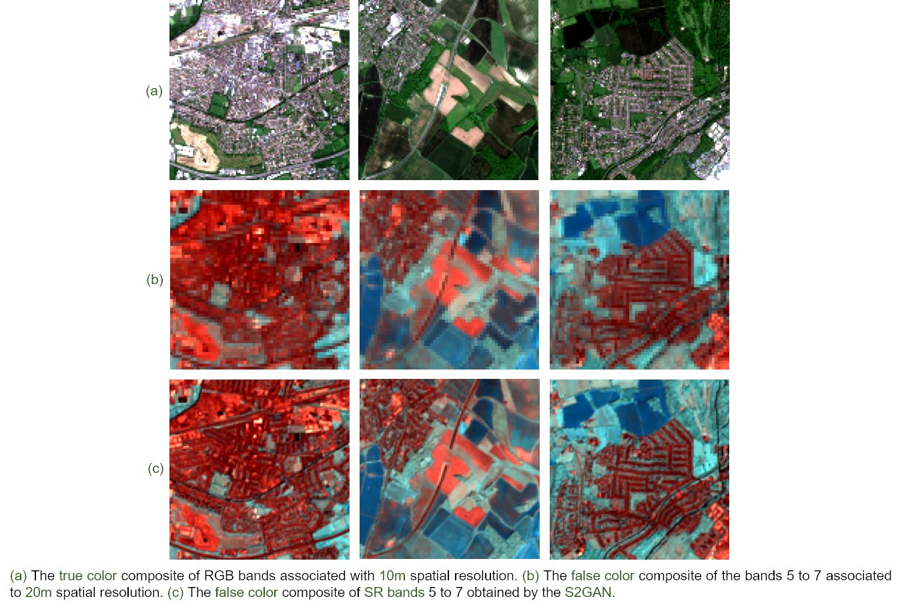
			

			

				An Approach to Super-Resolution of Sentinel-2 Images based on Generative Adversarial Networks  
				Kexin Zhang, Gencer Sumbul, Begüm Demir 
				IEEE Mediterranean and Middle-East Geoscience and Remote Sensing Symposium, Tunis, Tunisia, 2020. 
				<a class="publication-icon" href="https://arxiv.org/pdf/1912.06013.pdf" target="_blank"><i class="fa fa-file-pdf-o text-color-be"></i></a>
			

		

		

		

			

				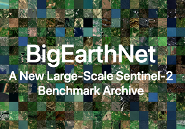
			

			

				BigEarthNet: A large-scale benchmark archive for remote sensing image understanding  
				Gencer Sumbul, Marcela Charfuelan, Begüm Demir, Volker Markl 
				IEEE International Geoscience and Remote Sensing Symposium, pp. 5901-5904, Yokohama, Japan, 2019. 
				<a class="publication-icon" href="assets/publications/pdfs/BigEarthNet_IGARSS_2019.pdf" target="_blank"><i class="fa fa-file-pdf-o text-color-be"></i></a>
 				<a class="publication-icon" href="http://bigearth.net" target="_blank"><i class="fa fa-database text-color-be"></i></a>
			

		

		

		

			

				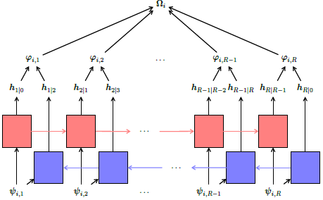
			

			

				A Novel Multi-Attention Driven System for Multi-Label Remote Sensing Image Classification  
				Gencer Sumbul, Begüm Demir 
				IEEE International Geoscience and Remote Sensing Symposium, Yokohama, Japan, 2019. 
				<a class="publication-icon" href="assets/publications/pdfs/CNN_RNN_IGARSS.pdf" target="_blank"><i class="fa fa-file-pdf-o text-color-be"></i></a>
				<a class="publication-icon" href="http://bigearth.net" target="_blank"><i class="fa fa-database text-color-be"></i></a>
			

		

		

		
			
			

				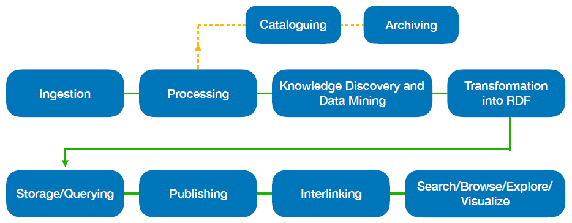
			

			

				From Big Data to Big Information and Big Knowledge: the Case of Earth Observation Data  
				Konstantina Bereta, Manolis Koubarakis, Stefan Manegold, George Stamoulis, Begüm Demir 
				Proceedings of the 27th ACM International Conference on Information and Knowledge Management, 2018. 
				<a class="publication-icon" href="assets/publications/pdfs/CASEEO-BeretaKoubarakisManegoldStamoulisDemirFinal.pdf" target="_blank"><i class="fa fa-file-pdf-o text-color-be"></i></a>
			

		

		
	
		
			
			

				
			

			

				An Unsupervised Multicode Hashing Method for Accurate and Scalable Remote Sensing Image Retrieval  
				Thomas Reato, Begüm Demir, Lorenzo Bruzzone  
				IEEE Geoscience and Remote Sensing Letters, vol. 16, no. 2, pp. 276- 280, Feb 2019. 
				<a class="publication-icon" href="assets/publications/pdfs/MCH-ReatoDemirBruzzone.pdf" target="_blank"><i class="fa fa-file-pdf-o text-color-be"></i></a>
				<a class="publication-icon" href="http://bigearth.eu/datasets.html" target="_blank"><i class="fa fa-database text-color-be"></i></a>
			

		

		
		
		
			
			

				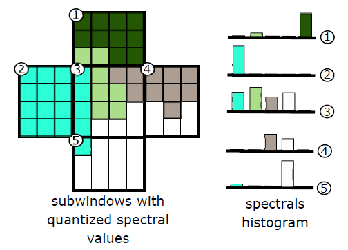
			

			

				A Novel System for Content based Retrieval of Single and Multi-Label High Dimensional Remote Sensing Images  
				Osman Emre Dai, Begüm Demir, Bülent Sankur, Lorenzo Bruzzone  
				IEEE Journal of Selected Topics in Applied Earth Observations and Remote Sensing, vol. 11, no. 7, pp.  2473 - 2490, July 2018. 
				<a class="publication-icon" href="assets/publications/pdfs/A-Novel-System-for-Content-based-Retrieval-of-Single-and-Multi-Label-High-Dimensional-Remote-Sensing-Images.pdf" target="_blank"><i class="fa fa-file-pdf-o text-color-be"></i></a>
				<a class="publication-icon" href="http://bit.ly/Ankara_HSI_Archive" target="_blank"><i class="fa fa-database text-color-be"></i></a>
			

		

		

		

			

				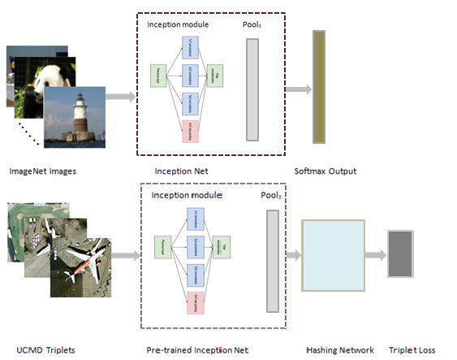
			

			

				Deep Metric and Hash-Code Learning for Content-Based Retrieval of Remote Sensing Images
				 
				Subhankar Roy, Enver Sangineto, Begüm Demir, Nicu Sebe 
				IEEE International Geoscience and Remote Sensing Symposium, Valencia, Spain, 2018.  
				<a class="publication-icon" href="assets/publications/pdfs/MHCLN-RoySanginetoDemirSebeFinal.pdf" target="_blank"><i class="publication-icon fa fa-file-pdf-o text-color-be"></i></a>
				<a class="publication-icon" href="https://github.com/MLEnthusiast/MHCLN" target="_blank"><i class="fa fa-github text-color-be"></i></a>
			

		

		

		

			

				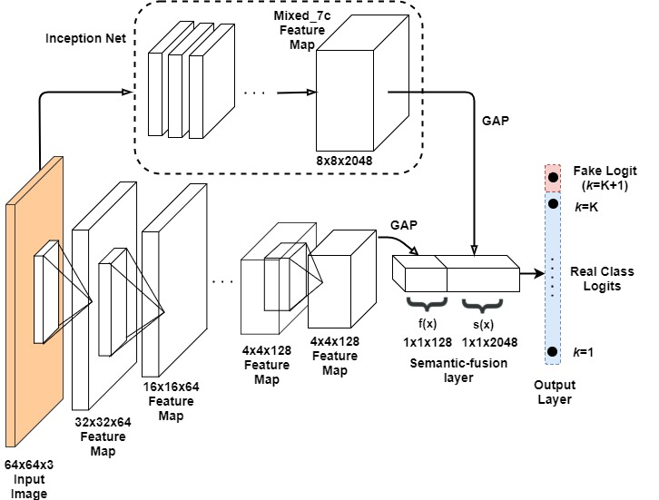
			

			

				Semantic-Fusion GANs for Semi-Supervised Satellite Image Classification
				 
				Subhankar Roy, Enver Sangineto, Begüm Demir, Nicu Sebe 
				IEEE International Conference on Image Processing, Athens, Greece, 2018.  
				<a class="publication-icon" href="assets/publications/pdfs/SGSSIC-RoySanginetoDemirSebeFinal.pdf" target="_blank"><i class="publication-icon fa fa-file-pdf-o text-color-be"></i></a>
				<a class="publication-icon" href="https://github.com/MLEnthusiast/SFGAN" target="_blank"><i class="fa fa-github text-color-be"></i></a>
			

		

		

		

			

				
			

			

				Advanced Local Binary Patterns for Remote Sensing Image Retrieval
				 
				Issayas Tekeste Mirach, Begüm Demir 
				IEEE International Geoscience and Remote Sensing Symposium, Valencia, Spain, 2018. 
				<a class="publication-icon" href="assets/publications/pdfs/Advanced-Local-Binary-Patterns-for-Remote-Sensing-Image-Retrieval.pdf" target="_blank"><i class="publication-icon fa fa-file-pdf-o text-color-be"></i></a>
			

		

		

		

			

				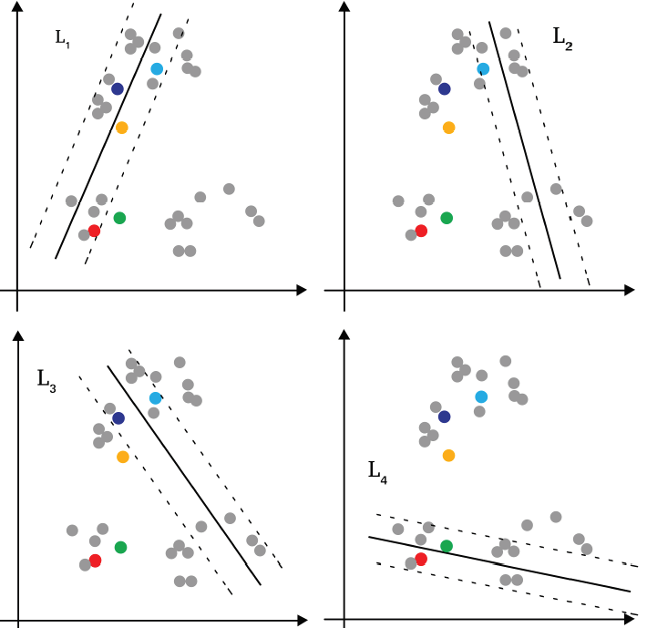
			

			

				A Novel Active Learning Technique for Multilabel Remote Sensing Image Scene Classification
				 
				Bayable Teshome Zegeye, Begüm Demir 
				SPIE Image and Signal Processing for Remote Sensing, Berlin, 2018.
			

		

		

		

			

				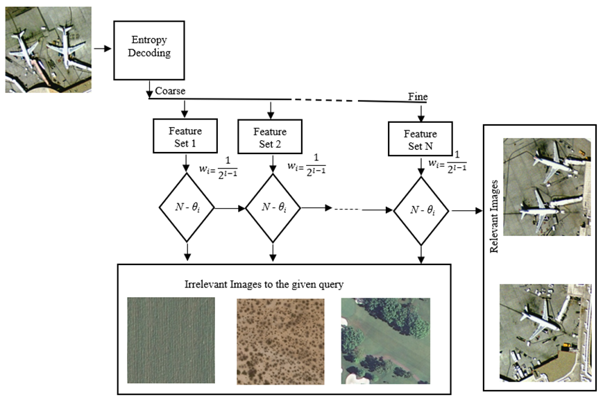
			

			

				A Novel Coarse-to-Fine Remote Sensing Image Retrieval System in JPEG-2000 Compressed Domain
				 
				Akshara Preethy Byju, Begüm Demir, Lorenzo Bruzzone 
				SPIE Image and Signal Processing for Remote Sensing, Berlin, 2018.
			

		

	

<!-- Modal -->
<!-- The Modal -->

  &times;
  
  

