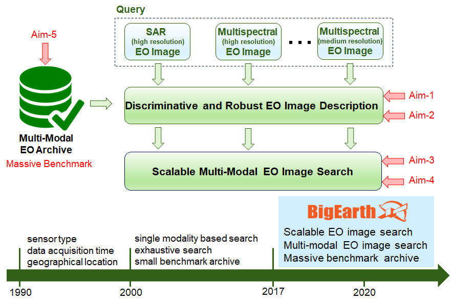

	

    	
The BigEarth project consists of five main Aims in total, from which four Aims are associated to the development of novel methodologies and tools on the main challenges of Big EO data and also one Aim is related to the benchmark archive construction to validate the algorithms and the software.

    	

    	
<strong>Aim 1:</strong> Development of novel methods and tools to characterize and exploit high level semantic and spectral information present in remote sensing images; 

		<strong>Aim 2:</strong> Development of novel feature extraction methods and tools to directly extract features from the compressed remote sensing images; 

		<strong>Aim 3:</strong> Development of accurate and scalable remote sensing image indexing and retrieval methods together with associated tools; 

		<strong>Aim 4:</strong> Development of multi-modal remote sensing image search and retrieval methods and tools; 

		<strong>Aim 5:</strong> Construction of a benchmark archive with high number of multi-source remote sensing images.
    	

    

